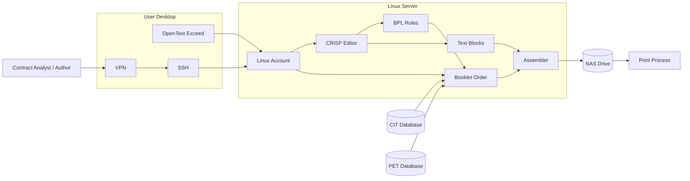
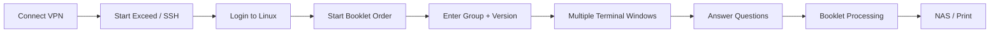
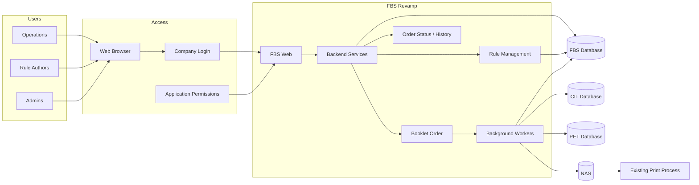
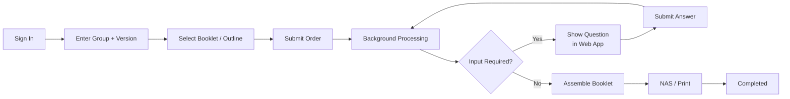

# FBS Revamp — Visual Overview

> **Goal:** Modernize how users access, operate, and support FBS while keeping the same core business outcome — generating the correct customized benefit booklet for printing.

---

## 1. What is FBS?

**FBS — Facet Booklet System** is used to create customized benefit booklets for a **group / plan**.

It brings together:

**Group / Plan Information** + **CIT/PET Data** + **Business Rules (BPL)** + **Booklet Content**  
↓  
### **FBS**
↓  
**Customized Benefit Booklet**  
↓  
**Print**

FBS is therefore not just a document generator. It determines **which content belongs in a booklet based on group data and business rules**, gathers additional user input when necessary, and assembles the result for printing.

---

## 2. What does FBS do?

| Capability | Purpose |
|---|---|
| **Booklet Order** | Starts booklet creation using group, version, booklet and outline |
| **Data Retrieval** | Gets required group/policy information from CIT/PET |
| **Business Rules** | Executes BPL rules to determine applicable content |
| **Interactive Questions** | Collects additional values when rules require them |
| **Content Selection** | Selects the appropriate reusable text blocks |
| **Assembly** | Combines generated information with booklet content |
| **Output** | Produces the files required by the downstream print process |

### Simplified processing

**Group + Version**  
→ **Retrieve Data**  
→ **Execute BPL**  
→ **Select Text Blocks**  
→ **Ask Questions if Needed**  
→ **Assemble**  
→ **RAW / PDF**  
→ **Print**

---

# 3. How BPL Business Rules Work

A `.bpl` file contains the **decision logic** used by FBS.

For example:

```bpl
;FILE: azet.bpl

script "AKASH ET FOR ARIZONA"
{
    if ( medical equals "N" AND
         drugs equals "N" AND
         is_dental_care equals "N" AND
         vision equals "N" )
        jumpto bottom

    if ( funding equals "A" OR
         funding equals "E" )
        include "cdbk/gen/broker/n1a"

    if ( medical equals "Y" )
    {
        if ( dependent_health equals "Y" )
        {
            if ( pre_exist_cond equals "Y" )
                include "book/az/etnotice/2a" send ( company )
            else
                include "book/az/etnotice/2b" send ( company )
        }

        include "cdbk/gen/broker/n1b"
    }

    import "bzet.bpl"

    prompt "telehealth_net_ov_option: \v\n",
           telehealth_net_ov_option

    assign telehealth_net_ov_option to junk2
}
```

### What the rule is doing

```text
                   BPL
                    │
        ┌───────────┼────────────┐
        │           │            │
       IF         INCLUDE      PROMPT
        │           │            │
        ▼           ▼            ▼
 Check data    Select content   Ask user
        │           │            │
        └───────────┴────────────┘
                    │
                    ▼
             Build the booklet
```

So BPL contains **logic**, not necessarily the actual text that appears in the booklet.

---

# 4. What is a Text Block?

A **Text Block** contains the actual reusable booklet content.

For example, the BPL rule:

```bpl
include "cdbk/gen/broker/n1a"
```

references content similar to:

```text
STANDARD    "cdbk/gen/broker/n1a"
AUTHOR      "huls"

IMPORT
(
    </broker_name1/> "Broker Name"
    </broker_name2/> "Broker Name cont."
    </broker_street1/> "Broker Street"
    </broker_street2/> "Broker Street cont."
    </broker_city_state/> "Broker city and state"
    </broker_zip/> "Broker Address"
    </broker_phone_num/> "Broker Phone Number"
)

DRAFTON

[NEWPAGE]

[BLANKLINE:"9"]
[CENTER:"Arranged by:"]
[BLANKLINE:"2"]

[CENTER:"[BOLD:"/broker_name1/"]"]
[CENTER:"[BOLD:"/broker_name2/"]"]
[CENTER:"/broker_street1/"]
[CENTER:"/broker_street2/"]
[CENTER:"/broker_city_state/"]
[CENTER:"/broker_zip/"]
[CENTER:"Phone Number: /broker_phone_num/"]

DRAFTOFF
```

### BPL + Text Block relationship

```text
CIT / PET Data
      │
      ▼
┌────────────────────┐
│      BPL RULE      │
│                    │
│ IF funding = A/E   │
└─────────┬──────────┘
          │
          │ include
          ▼
┌─────────────────────────────┐
│ cdbk/gen/broker/n1a         │
│                             │
│ Broker Name                 │
│ Address                     │
│ City / State / ZIP          │
│ Phone                       │
└──────────────┬──────────────┘
               │
               ▼
       FINAL BOOKLET PAGE
```

This separation is important:

**BPL = decision/logic**  
**Text Block = actual booklet content**

---

# 5. Legacy FBS Architecture



### Legacy model

**User → VPN → Exceed/SSH → Linux → CRiSP/Booklet Order → CIT/PET → Assembler → NAS → Print**

---

# 6. How Users Work Today



For rule authors:

**VPN → Exceed/SSH → Linux → CRiSp → Find BPL/Text Block → Edit → Save → Run Booklet Order to Test**

The problem is that a business user or author must understand significant parts of the **technical Linux environment** just to perform normal FBS work.

---

# 7. Current Pain Points

| Area | Current Problem |
|---|---|
| **Access** | Separate Linux accounts |
| **Provisioning** | Support manually configures users |
| **Desktop** | OpenText Exceed dependency |
| **Rule Editing** | CRiSP dependency |
| **Booklet Ordering** | Multiple terminal windows |
| **Questions** | Prompts can appear in different terminal sessions |
| **Rules** | Large numbers of BPL/content files |
| **Discovery** | Difficult to find the correct rule/content |
| **Permissions** | Shared-folder permission problems |
| **History** | No simple centralized order history |
| **Troubleshooting** | Information distributed across terminals/files/databases |
| **Infrastructure** | Interactive users consume Linux resources |
| **Modernization** | Legacy tools create RHEL/AD compatibility concerns |

---

# 8. What If We Don't Revamp?

The existing FBS business process can continue, but the surrounding operational problems remain.

**Legacy dependency continues**  
→ Exceed + CRiSP + Linux accounts

**User provisioning continues**  
→ Support configures individual environments

**Infrastructure modernization becomes harder**  
→ Legacy tools must continue working with newer environments

**Global/AD access remains difficult**  
→ Legacy account model remains part of FBS

**Rules remain file-oriented**  
→ Search, permissions and maintenance remain difficult

**User sessions remain infrastructure-heavy**  
→ Scaling users means continuing to support interactive Linux sessions

**Legacy expertise remains critical**  
→ Knowledge of scripts, folders, terminals and processing remains concentrated

### Result

> **Increasing support burden + modernization risk + infrastructure dependency around a business-critical process.**

---

# 9. New FBS Architecture



### Fundamental architecture change

**Legacy**

`User → operates Linux environment → processing`

**Revamp**

`User → operates FBS Web → system manages processing`

The technical processing becomes a responsibility of the application rather than the end user.

---

# 10. How the New Booklet Process Works



### User experience

**Sign in → Select → Submit → Watch Progress → Answer if Needed → Done**

The user no longer needs to manage background terminals or know which Linux process is running.

---

# 11. How Revamp Resolves the Pain Points

| Legacy | → | FBS Revamp |
|---|---|---|
| OpenText Exceed | → | **Web Browser** |
| Linux user account | → | **Company Login** |
| Manual Linux provisioning | → | **Application Permissions** |
| Terminal workflow | → | **Guided Web Forms** |
| Multiple windows | → | **Single Order View** |
| CRiSP | → | **Browser Rule Editor** |
| Shared BPL/content discovery | → | **Searchable Rule Library** |
| Terminal questions | → | **Web Questions** |
| Terminal logs | → | **Live Status** |
| Distributed history | → | **Order History** |
| Interactive Linux sessions | → | **Background Workers** |
| User manages processing | → | **Application manages processing** |

---

# 12. New Technology Stack

This section should stay at the **architecture level until exact framework choices are confirmed**.

### Experience

**Web Browser**  
↓  
**FBS Web UI**

### Security & Access

**Company Authentication**  
+  
**Role / Permission Management**

### Application

**Backend APIs / Services**

- Booklet Order
- Rule Management
- Order Status
- Order History

### Processing

**Background Workers**

- Business-rule processing
- User-input orchestration
- Booklet generation
- Assembly

### Runtime

**Container-based deployment**

Processing workers can be separated from interactive web traffic.

### Data & Integration

**FBS Database**  
**CIT Database**  
**PET Database**  
**NAS / Print Output**

Exact frontend framework, backend framework, FBS database engine, and container platform should be added once those choices are confirmed.

---

# FBS Revamp in One View

### Today

**User**  
↓  
VPN  
↓  
Exceed + SSH  
↓  
Linux Account  
↓  
Terminal + CRiSP  
↓  
Booklet Processing  
↓  
CIT / PET / Files  
↓  
NAS  
↓  
Print

### Revamp

**User**  
↓  
Browser + Company Login  
↓  
FBS Web  
↓  
Backend Services  
↓  
Background Workers  
↓  
CIT / PET / FBS Data  
↓  
NAS  
↓  
Print

> ### **Same booklet business outcome.**
> **Simpler access · easier rule management · better visibility · lower legacy dependency · modern processing model.**
